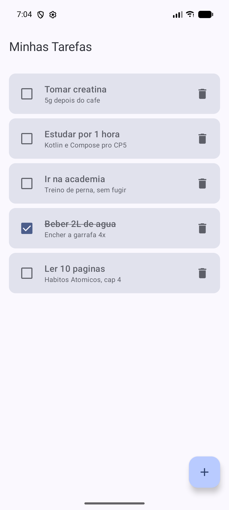
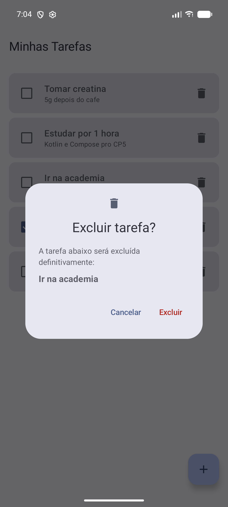
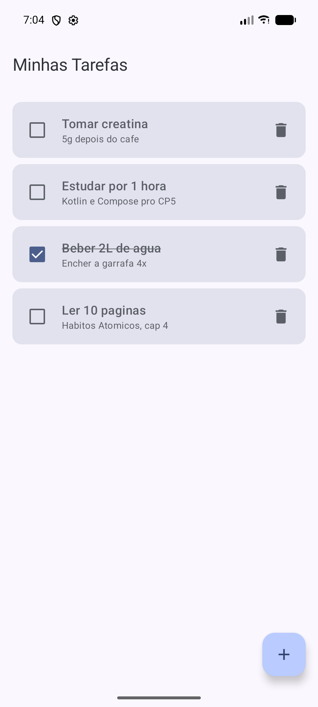

# Evidências da exclusão com confirmação

Antes, era só encostar na lixeira que a tarefa sumia na hora, sem volta. Agora aparece um
diálogo perguntando se é isso mesmo, e dá pra cancelar ou confirmar.

Pra testar coloquei no emulador umas tarefas da minha rotina mesmo (creatina, academia,
leitura...). Deixei "Beber 2L de agua" como concluída pra mostrar que o check continua
funcionando. A tarefa que escolhi apagar foi **Ir na academia**, que fica no meio da lista,
assim dá pra ver que só ela sai e as outras ficam.

### 1. Lista antes de apagar

5 tarefas cadastradas, com "Ir na academia" no meio.

### 2. Cliquei na lixeira de "Ir na academia"

O diálogo abre por cima da lista (não troca de tela) e mostra o nome da tarefa que vai ser
apagada, pra não ter erro de apagar a errada.

### 3. Apertei Cancelar

O diálogo fechou e a lista continuou igual, com as 5 tarefas.

### 4. Abri o diálogo de novo

Cliquei outra vez na mesma lixeira e o diálogo voltou com "Ir na academia".

### 5. Agora apertei Excluir

Só "Ir na academia" saiu. Creatina, estudo, água (ainda marcada) e leitura continuam lá.

---

**Como fiz:** a tarefa que está esperando confirmação fica guardada no `TarefaViewModel`
(`tarefaParaExcluir`). A lixeira só chama `solicitarExclusao`, e o `AlertDialog` do Material 3
aparece enquanto esse valor não for nulo. O Cancelar limpa o valor, e o Excluir apaga
exatamente a tarefa que estava guardada. Também coloquei uma `@Preview` do diálogo aberto
no `ListaTarefasScreen.kt`.
