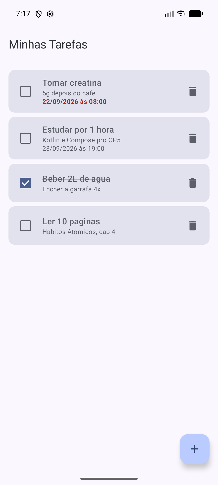
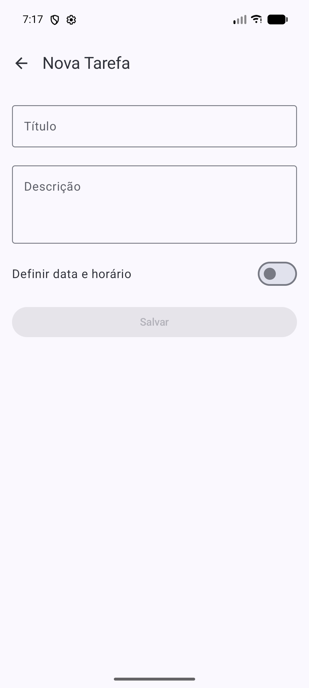
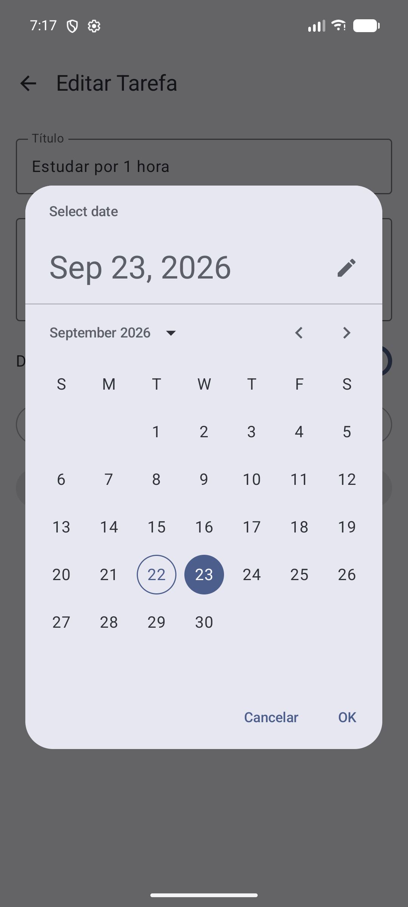
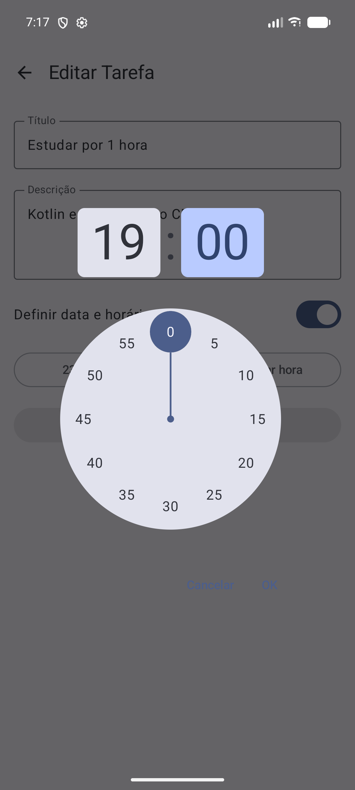
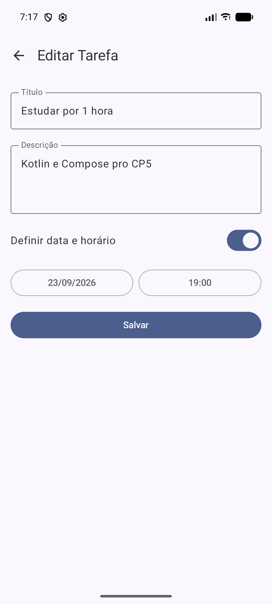
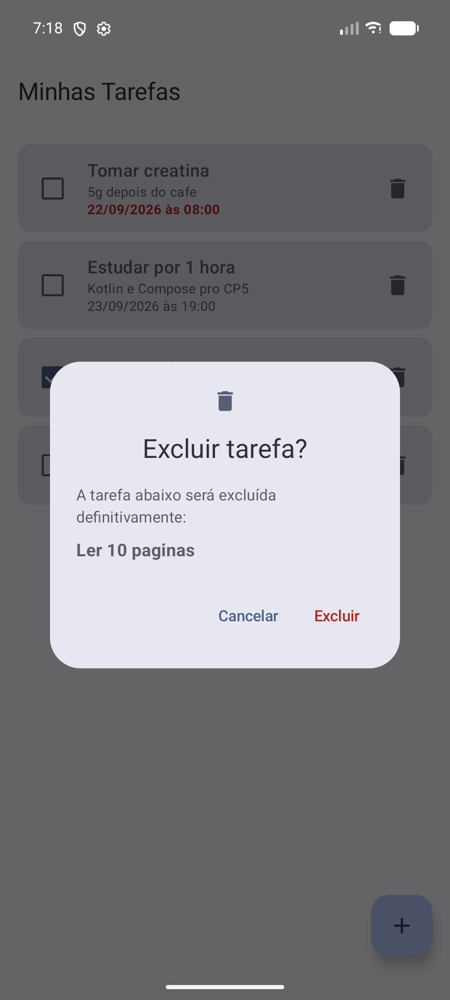

# To-Do List

Aplicativo Android de lista de tarefas feito em Kotlin com Jetpack Compose. Dá pra cadastrar,
editar, concluir e excluir tarefas, além de definir um prazo com data e hora. Os dados ficam
salvos no aparelho com Room, então nada se perde ao fechar o app.

## Funcionalidades

- Cadastrar tarefa com título, descrição e prazo opcional (data e hora)
- Listar as tarefas ordenadas pelo prazo
- Destacar em vermelho as tarefas atrasadas
- Editar uma tarefa tocando no card
- Marcar e desmarcar como concluída
- Excluir com confirmação antes

## Telas

### Lista de tarefas

Tela inicial. Cada card mostra título, descrição e prazo. Tarefa atrasada aparece com o prazo
em vermelho e tarefa concluída fica riscada. O botão **+** abre o formulário e o toque no card
abre a edição.



### Nova tarefa

Formulário em branco com título, descrição e a opção de definir data e horário.



### Seleção de data e hora

Com a opção de prazo ligada, aparecem os botões para escolher a data (`DatePicker`) e a hora
(`TimePicker`), ambos do Material 3.

 

### Editar tarefa

Mesma tela do cadastro, mas já preenchida com os dados da tarefa.



### Confirmação de exclusão

Ao tocar na lixeira abre um diálogo por cima da lista com o nome da tarefa. **Cancelar** fecha
sem mudar nada e **Excluir** apaga só aquela tarefa. O passo a passo completo está em
[EVIDENCIAS_EXCLUSAO.md](EVIDENCIAS_EXCLUSAO.md).



## Tecnologias

- Kotlin
- Jetpack Compose e Material 3
- Room (SQLite local)
- Coroutines e Flow
- ViewModel (MVVM)
- Navigation Compose

## Arquitetura

O projeto segue MVVM. A tela nunca acessa o banco direto: ela conversa com o ViewModel, que
usa o repositório.

```
MainActivity
     |
AppNavigation (NavHost)
     |
     +-- ListaTarefasScreen
     +-- FormularioTarefaScreen
     |
TarefaViewModel
     |
TarefaRepository
     |
TarefaDao -> TarefaDatabase (Room)
```

```
app/src/main/java/com/github/ricardoalmeidas/to_do_list/
├── MainActivity.kt
├── data/          Tarefa (Entity), TarefaDao e TarefaDatabase
├── navigation/    AppNavigation com as rotas
├── repository/    TarefaRepository
├── ui/screens/    ListaTarefasScreen e FormularioTarefaScreen
├── ui/theme/      cores, tipografia e tema
├── util/          DataHoraUtil (conversão e formatação de data e hora)
└── viewmodel/     TarefaViewModel
```

| Camada | Responsabilidade |
|---|---|
| `data` | `Tarefa` é a tabela do Room. O `TarefaDao` lista (ordenado pelo prazo), insere, atualiza e exclui. |
| `repository` | Esconde o Room do resto do app e expõe as tarefas como `Flow`. |
| `viewmodel` | Transforma o `Flow` em `StateFlow`, executa as ações no `viewModelScope` e guarda a tarefa que está aguardando confirmação de exclusão. |
| `ui/screens` | Telas em Compose. Cada uma tem uma versão `Content` que recebe só dados e callbacks, o que permite usar `@Preview`. |
| `navigation` | Rotas `lista` e `formulario/{tarefaId}`. O id `0` abre o formulário para uma tarefa nova. |
| `util` | Funções para converter a data do `DatePicker` e formatar o prazo como `dd/MM/yyyy às HH:mm`. |

## Testes

Os testes instrumentados ficam em `app/src/androidTest` e cobrem o DAO (com banco em memória)
e o utilitário de data e hora.

```
./gradlew connectedAndroidTest
```

## Como executar

1. Clone o repositório.
2. Abra a pasta raiz no Android Studio (**Open**).
3. Espere o Gradle Sync terminar.
4. Inicie um emulador ou conecte um celular com depuração USB.
5. Clique em **Run**.

## Requisitos

- Android Studio atualizado
- JDK 21
- minSdk 24 e targetSdk 36
